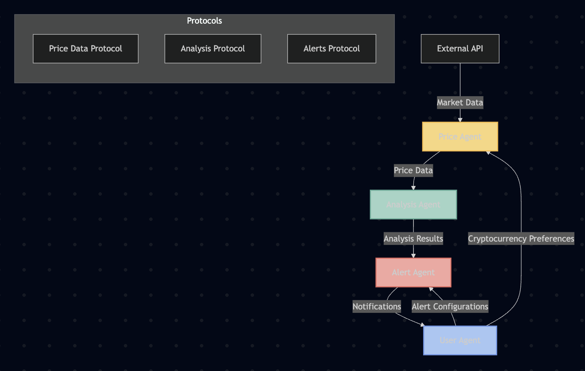

# DeFi Price Monitoring and Alert System

A multi-agent system for monitoring cryptocurrency prices, performing technical analysis, and sending alerts based on user-defined conditions.



## Overview

This project demonstrates the capabilities of the Agentverse platform by implementing a practical DeFi tool that helps users monitor cryptocurrency prices and receive alerts based on various conditions. The system consists of multiple autonomous agents that work together to fetch data, analyze it, and notify users when specific conditions are met.

### Key Features

- **Real-time Price Monitoring**: Fetch cryptocurrency prices from public APIs
- **Technical Analysis**: Calculate indicators like RSI, MACD, and moving averages
- **Customizable Alerts**: Configure alerts based on price thresholds or technical indicators
- **Multi-Agent Architecture**: Demonstrates how multiple agents can work together
- **Persistent Storage**: Store historical data and user preferences
- **Extensible Design**: Easy to add new cryptocurrencies, indicators, or alert types

## System Architecture

The system consists of four main agents:

1. **Price Agent**: Fetches cryptocurrency prices from external APIs and broadcasts updates
2. **Analysis Agent**: Performs technical analysis on price data and generates trading signals
3. **Alert Agent**: Monitors analysis results and triggers alerts based on user-defined conditions
4. **User Agent**: Manages user preferences and receives notifications

### Agent Communication

Agents communicate with each other using well-defined message protocols:

- **Price Data Protocol**: For exchanging cryptocurrency price information
- **Analysis Protocol**: For requesting and receiving technical analysis results
- **Alert Protocol**: For configuring alerts and receiving notifications

## Installation

### Prerequisites

- Python 3.8 or higher
- pip (Python package manager)

### Setup

1. Clone the repository:
   ```bash
   git clone <repository-url>
   cd sample-project-1-price-monitor-alerts
   ```

2. Create and activate a virtual environment:
   ```bash
   python -m venv venv
   source venv/bin/activate  # On Windows: venv\Scripts\activate
   ```

3. Install dependencies:
   ```bash
   pip install -r requirements.txt
   ```

4. Create a `.env` file from the template:
   ```bash
   cp .env.template .env
   ```

5. Edit the `.env` file to add your API keys and customize settings:
   ```
   # API Keys for cryptocurrency data
   COINGECKO_API_KEY=your_coingecko_api_key_here
   
   # Agent configuration
   PRICE_AGENT_SEED=your_price_agent_seed_here
   ANALYSIS_AGENT_SEED=your_analysis_agent_seed_here
   ALERT_AGENT_SEED=your_alert_agent_seed_here
   USER_AGENT_SEED=your_user_agent_seed_here
   
   # Default cryptocurrencies to monitor
   DEFAULT_CRYPTOCURRENCIES=BTC,ETH,SOL,AVAX,DOT
   ```

## Usage

### Running the System

To start all agents:

```bash
python run.py
```

To run specific agents:

```bash
python run.py --agents price analysis
```

To enable debug mode with more verbose output:

```bash
python run.py --debug
```

### Configuring Alerts

Alerts can be configured programmatically through the User Agent. Here are some examples:

#### Price Alert

```python
# Create a price alert for Bitcoin
alert_config = AlertConfig.create(
    symbol="BTC",
    alert_type=AlertType.PRICE_ABOVE,
    threshold=50000.0,
    description="Bitcoin price above $50,000"
)

await configure_alert(ctx, alert_config)
```

#### RSI Alert

```python
# Create an RSI alert for Ethereum
alert_config = AlertConfig.create(
    symbol="ETH",
    alert_type=AlertType.RSI_OVERBOUGHT,
    threshold=70.0,
    description="Ethereum RSI overbought"
)

await configure_alert(ctx, alert_config)
```

## Alert Types

The system supports various types of alerts:

- **Price Alerts**:
  - `PRICE_ABOVE`: Triggered when price rises above a threshold
  - `PRICE_BELOW`: Triggered when price falls below a threshold
  - `PERCENT_CHANGE`: Triggered when price changes by a percentage

- **Technical Indicator Alerts**:
  - `RSI_OVERBOUGHT`: Triggered when RSI rises above a threshold
  - `RSI_OVERSOLD`: Triggered when RSI falls below a threshold
  - `MACD_CROSSOVER`: Triggered when MACD crosses above signal line
  - `MACD_CROSSUNDER`: Triggered when MACD crosses below signal line
  - `TREND_REVERSAL`: Triggered when price trend changes direction

## Extension Ideas

Here are some ways to extend this project:

1. **Additional Data Sources**: Integrate with more APIs or blockchain data sources
2. **Advanced Analysis**: Implement more sophisticated technical analysis or ML-based predictions
3. **Trading Integration**: Connect with exchange APIs to execute trades based on alerts
4. **Cross-Chain Monitoring**: Extend to monitor assets across multiple blockchains
5. **DeFi Protocol Integration**: Monitor liquidity pools, yield farms, or lending protocols
6. **Web Interface**: Create a web dashboard to visualize data and manage alerts
7. **Notification Channels**: Add support for email, SMS, or messaging platforms

## Project Structure

```
sample-project-1-price-monitor-alerts/
├── README.md                       # Project documentation
├── .env.template                   # Template for environment variables
├── requirements.txt                # Project dependencies
├── run.py                          # Script to run all agents
├── diagrams/                       # Architecture diagrams
│   └── system_architecture.png     # Visual representation of the system
├── protocols/                      # Shared message protocols
│   ├── __init__.py
│   ├── price_data.py               # Price data message models
│   ├── analysis.py                 # Analysis result message models
│   └── alerts.py                   # Alert configuration message models
└── agents/
    ├── __init__.py
    ├── price_agent.py              # Fetches cryptocurrency prices
    ├── analysis_agent.py           # Analyzes price movements
    ├── alert_agent.py              # Sends notifications
    └── user_agent.py               # Manages user preferences
```

## Technical Details

### Price Agent

The Price Agent fetches cryptocurrency prices from the CoinGecko API at regular intervals. It stores historical price data and broadcasts updates to subscribed agents. It also responds to direct requests for price data.

### Analysis Agent

The Analysis Agent performs technical analysis on price data, calculating indicators like RSI, MACD, and moving averages. It determines price trends and generates trading signals based on the indicators.

### Alert Agent

The Alert Agent maintains a list of alert configurations and checks if any alerts should be triggered based on the latest analysis results. When an alert is triggered, it sends a notification to the User Agent.

### User Agent

The User Agent manages user preferences and receives alert notifications. It provides methods for configuring alerts and requesting price data or analysis results.

## License

This project is licensed under the MIT License - see the LICENSE file for details.

## Acknowledgments

- [Fetch.ai](https://fetch.ai/) for the uAgents framework
- [CoinGecko](https://www.coingecko.com/) for the cryptocurrency price data API
